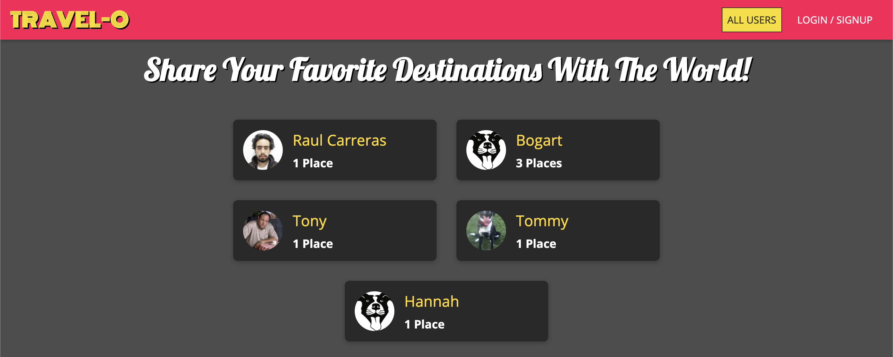
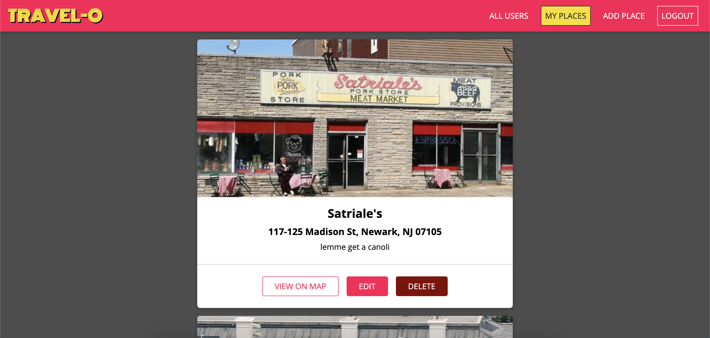
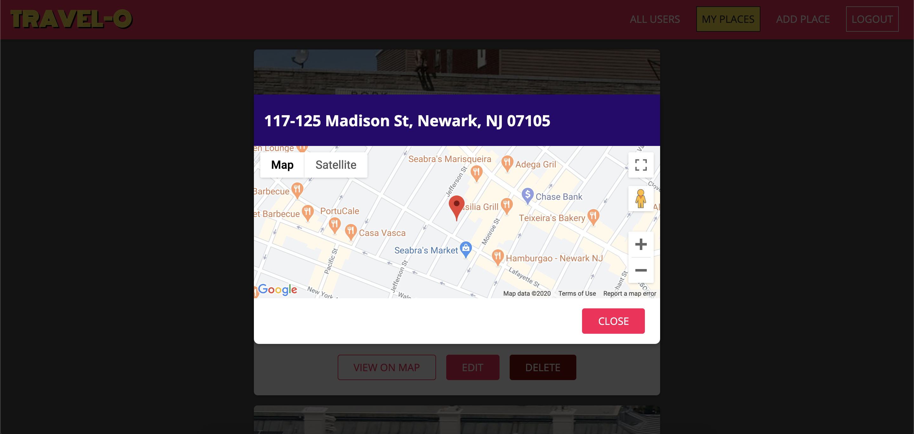
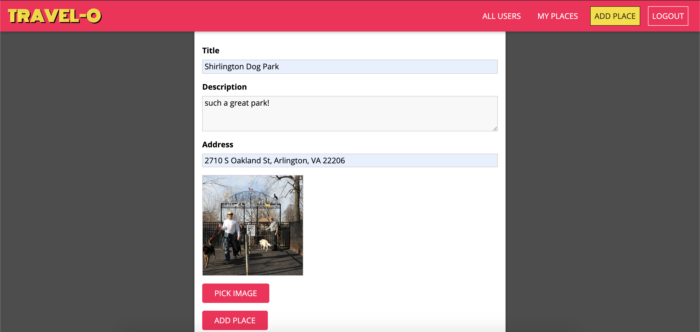
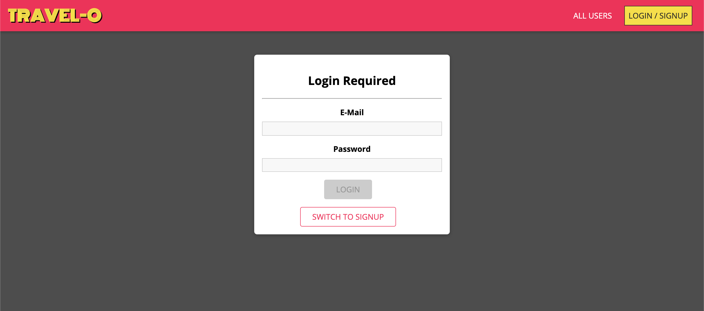
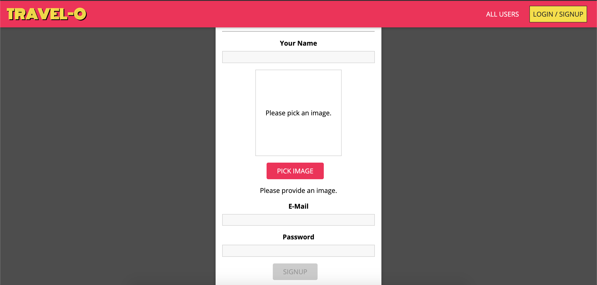

# Travel-O - Back End
Server side of React DevConnector Client. Contains functions to enable CRUD operations for client side application.

Visit the live site here: https://travel-o.web.app/

---

## Technologies Used
- Node
- Express Framework
- Bcrypt
- Jwt Security
- Mongoose
- Multer

---

## Functionality

### Users

Allows users to create accounts 

```    
  name: { type: String, required: true },
  email: { type: String, required: true, unique: true },
  password: { type: String, required: true, minlength: 6 },
  image: { type: String, required: true },
  places: [{ type: mongoose.Types.ObjectId, required: true, ref: 'Place' }]

```

### Place

Allows user to create a place with a title, description, image and address that allows them to view their location on a pop up map modal

```
  title: { type: String, required: true },
  description: { type: String, required: true },
  image: { type: String, required: true },
  address: { type: String, required: true },
  location: {
    lat: { type: Number, required: true },
    lng: { type: Number, required: true }
  },

```
---

## API Overview

## Places

GET 
```
@route   GET api/places/image
@desc    Gets places by ID
@access  Private

router.get('/:pid', placesControllers.getPlaceById);
```
GET 
```
@route   GET api/places/user/:uid
@desc    Gets place but user id
@access  Private

router.get('/user/:uid', placesControllers.getPlacesByUserId);
```
POST
```
@route   POST api/places/image
@desc    Allows users to create new place
@access  Private

[
    check('title')
      .not()
      .isEmpty(),
    check('description').isLength({ min: 5 }),
    check('address')
      .not()
      .isEmpty()
  ],
```
PATCH
```
@route   PATCH api/places/:pid
@desc    Allows users to update place
@access  Private

  [
    check('title')
      .not()
      .isEmpty(),
    check('description').isLength({ min: 5 })
  ],
```

## Users

GET
```
@route   GET /api/users
@desc    Gets users
@access  Public

router.get('/', usersController.getUsers);

```
POST
```
@route   GET /api/users/signup
@desc    Allows users to create account
@access  Public

  fileUpload.single('image'),
  [
    check('name').not().isEmpty(),
    check('email').normalizeEmail().isEmail(),
    check('password').isLength({ min: 6 }),
  ],
```
POST
```
@route   GET /api/users/login
@desc    Allows user to login
@access  Public

router.post('/login', usersController.login);
```
---
## Screenshots

### Landing


### Place Card


### Map Modal


### New Place Page


### Login Page


### SignUp Page

